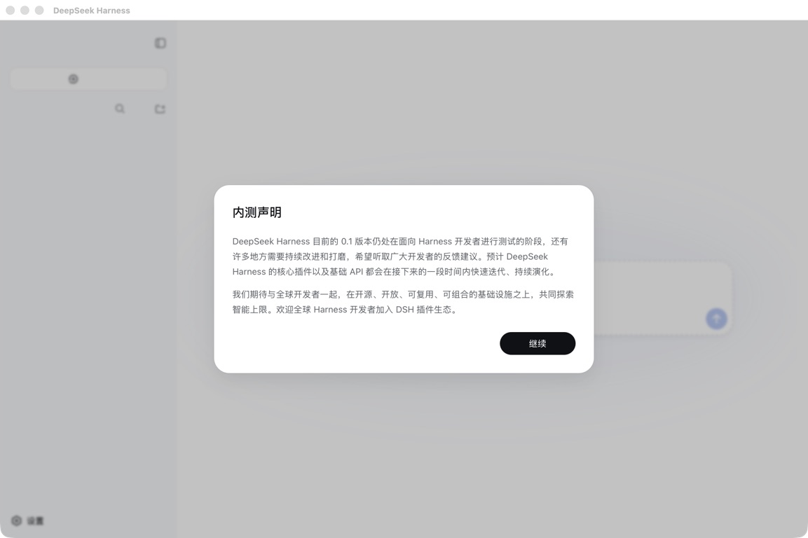
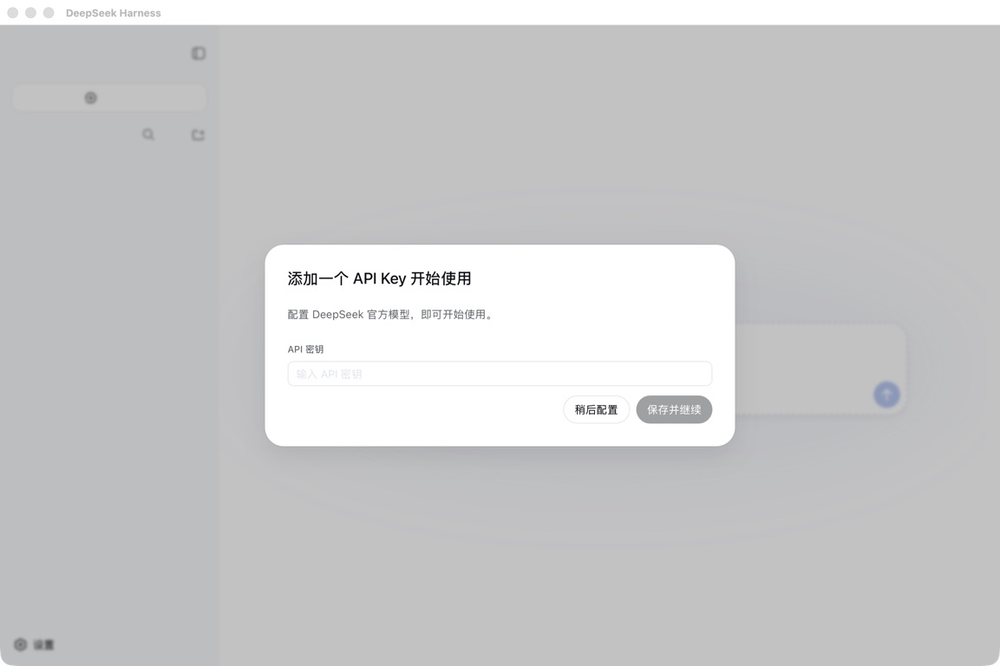
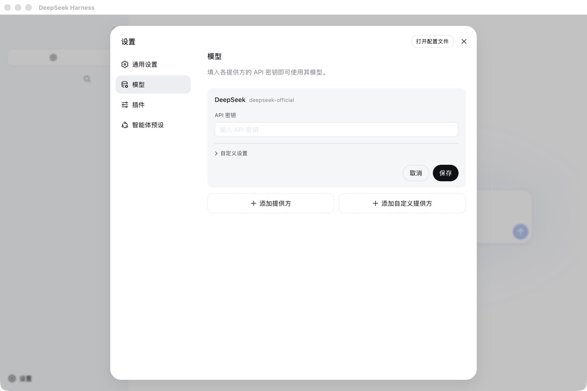
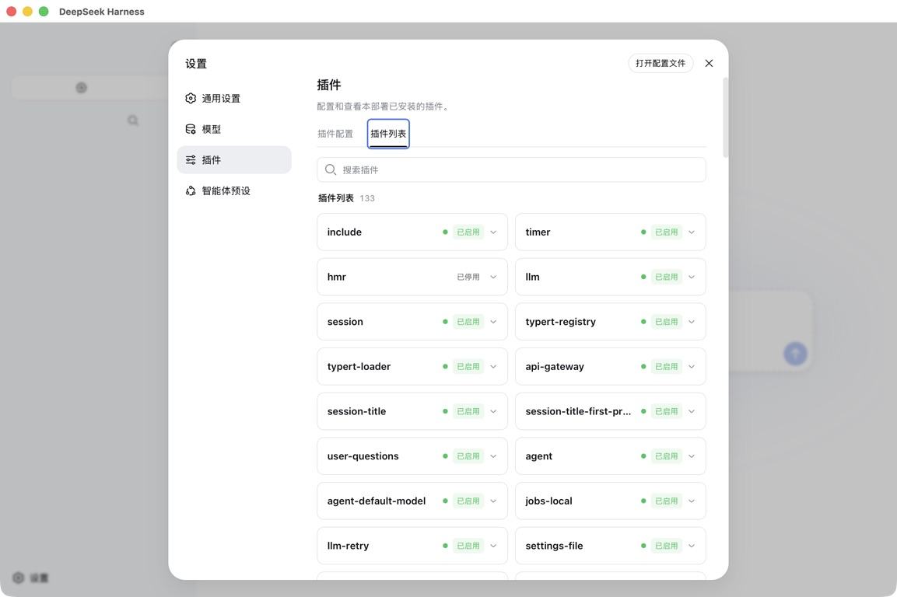

# DeepSeek Harness Ultimate: gids voor beginners

Deze gids gaat ervan uit dat u nog nooit een terminal hebt gebruikt. Volg de stappen op volgorde en voer elke kleine controle uit; programmeerkennis is niet nodig.

**Talen van de gids:** [English](TUTORIAL.md) · [简体中文](TUTORIAL.zh-CN.md) · [繁體中文](TUTORIAL.zh-TW.md) · [Español](TUTORIAL.es.md) · [Français](TUTORIAL.fr.md) · [Deutsch](TUTORIAL.de.md) · [Português (Brasil)](TUTORIAL.pt-BR.md) · [Русский](TUTORIAL.ru.md) · [日本語](TUTORIAL.ja.md) · [한국어](TUTORIAL.ko.md) · [العربية](TUTORIAL.ar.md) · [हिन्दी](TUTORIAL.hi.md) · [Italiano](TUTORIAL.it.md) · [Bahasa Indonesia](TUTORIAL.id.md) · [Türkçe](TUTORIAL.tr.md) · [Tiếng Việt](TUTORIAL.vi.md) · [ไทย](TUTORIAL.th.md) · [Polski](TUTORIAL.pl.md) · Nederlands · [Українська](TUTORIAL.uk.md)

[Terug naar de introductie](README.nl.md)

## Visuele gids

Deze screenshots komen uit schone profielen zonder sessies, inloggegevens of privégegevens. macOS toont de native shell; Windows toont dezelfde DSH Web UI op een echte Windows-runner.



*Native macOS-app — Melding voor ontwikkelaarspreview*



*Native macOS-app — Onboarding met lege API-sleutel*


*Native macOS-app — Start zonder workspace*



*Native macOS-app — Modelinstellingen met leeg sleutelveld*



*Native macOS-app — Plugininventaris met 133 items*


*DSH Web UI voor Windows — Melding voor ontwikkelaarspreview*


*DSH Web UI voor Windows — Onboarding met lege API-sleutel*


*DSH Web UI voor Windows — Start zonder workspace*


*DSH Web UI voor Windows — Modelinstellingen met leeg sleutelveld*


*DSH Web UI voor Windows — Plugininventaris met 133 items*

## 1. Wat wordt geïnstalleerd

Ultimate is een profile-installer, geen model en geen officiële DeepSeek AI-desktopapp. Hij biedt een praktische selectie zonder dubbelen, met gecontroleerde licenties en vaste versies; u hebt nog steeds uw eigen modelaccount nodig.

## 2. Voorbereiding en Node.js

Bereid een ondersteunde computer, stabiel internet, installatierecht voor uw account en een eenvoudige werkmap zoals Documents/DSH-Work voor. Installeer LTS vanaf nodejs.org en open PowerShell of Terminal opnieuw.

```text
node --version
```

`v22.x.x` of een hogere hoofdversie is succesvol.

## 3. Downloaden en installeren

Kies op GitHub Code → Download ZIP, pak uit en open de map met package.json, profile, scripts en windows. In Windows kunt u windows/install-ultimate.cmd dubbelklikken; op macOS/Linux gebruikt u de opdrachten hieronder.

```bash
git clone https://github.com/18126295767-cell/deepseek-harness-ultimate.git
cd deepseek-harness-ultimate
```

### Windows PowerShell

```powershell
node --version
& .\windows\install-ultimate.ps1
```

### macOS / Linux

```bash
node --version
node scripts/audit-manifest.mjs
node scripts/install-ultimate.mjs --profile-dir "$HOME/.dsh/profiles/ultimate"
```

Een geslaagde installatie toont `Platform filter: windows`, `Platform filter: macos` of `Platform filter: linux`.

## 4. Eerste start en model

Start DSH vanuit de map waar de Agent moet werken. 127.0.0.1 betekent alleen uw eigen computer; laat de terminal open. Open daarna Settings → Models en voer provider en sleutel alleen daar in.

### macOS or Linux

```bash
cd "$HOME/Documents/DSH-Work"
npx --yes @deepseek-ai/dsh@0.1.0-rc.7 --profile ultimate
```

### Windows PowerShell

```powershell
Set-Location "$HOME\Documents\DSH-Work"
npx --yes @deepseek-ai/dsh@0.1.0-rc.7 --profile ultimate
```

## 5. Workspace en eerste test

Klik op Choose workspace, voeg uw werkmap toe en selecteer deze, maak een nieuwe sessie en stuur eerst: List the files in this workspace. Do not change anything. Verschijnen de juiste bestanden zonder modelfout, dan werkt de basisconfiguratie.

## 6. Bestaande lokale app en optionele plugins

Hebt u al een lokale macOS-app die profile web start, sluit die dan en kopieer ~/.dsh/profiles/web voordat u daar installeert. cordis.patch.yml blijft behouden, maar npm kan plugins buiten het manifest verwijderen. Schakel telefoon, IM, meldingen en beveiliging pas in na COMPONENTS.md.

```bash
node scripts/install-ultimate.mjs --profile-dir "$HOME/.dsh/profiles/web"
open -a "DeepSeek Harness"
```

```bash
node scripts/install-ultimate.mjs \
  --profile-dir "$HOME/.dsh/profiles/ultimate" \
  --include dsh-notifier
```

## 7. Controleren, bijwerken, verwijderen en veiligheid

Voer de profile-audit uit; de laatste regel moet Profile dependency integrity: OK zijn. Stop DSH en bewaar de profile vóór een update. Voor verwijderen stopt u DSH en verplaatst u ~/.dsh/profiles/ultimate naar de prullenmand. Verwijder bij een fout geen willekeurige bestanden en publiceer nooit sleutels of tokens.

```bash
node scripts/audit-installed-profile.mjs \
  --profile-dir "$HOME/.dsh/profiles/ultimate"
```

Verwachte laatste regel: `Profile dependency integrity: OK`.

## Controle voor ontwikkelaars

```bash
npm ci --ignore-scripts
npm test
npm run audit
git diff --check
```

Installer en manifest gebruiken MIT. Gedownloade componenten behouden hun upstream-licenties; Ultimate herlicentieert ze niet.
